LR6
# Лабораторная работа №6
## Система контроля версий
---
**Цель работы:** изучение базовых возможностей системы управления версиями, опыт работы с Git Api, опыт работы с локальным и удаленным репозиторием.

Для выполнения задания был создан аккаунт на Github (рис. №1).

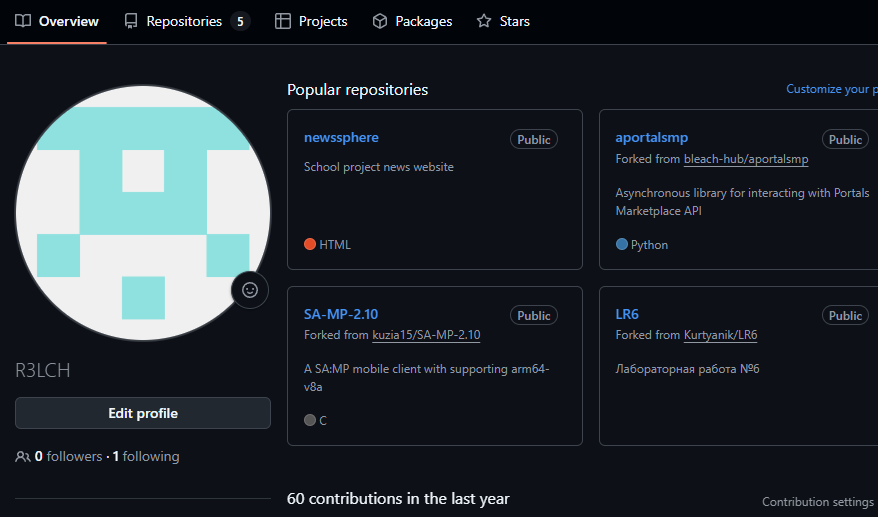
Рисунок 1. Зарегистрированный аккаунт на Github

Личная копия репозитория задания была сделана при помощи кнопки Fork на странице репозитория (https://github.com/Kurtyanik/LR6/).

Для работы с Github локально был установлен Git с официального сайта (https://git-scm.com/)

Для работы с Github нужно установить имя пользователя и почту, что можно сделать при помощи команд: git config --global user.name и git config --global user.email соответственно. Результат выполнения приведен на рис. №2.

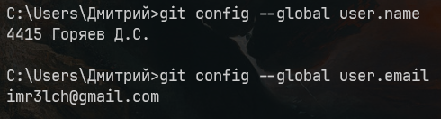
Рисунок 2. установленные почта и имя в git

Чтобы клонировать личный удаленный репозиторий на Github на компьютер была использована команда: git clone (рис. №3).

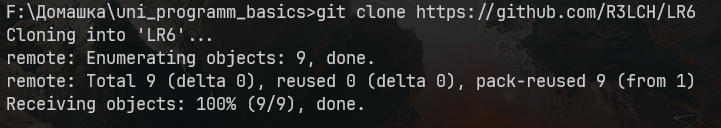
Рисунок 3. Процесс клонирования репозитория

Файл в репозиторий может быть добавлен при помощи кнопки Add file, прямо на Github'е, что показано на рис. №4.

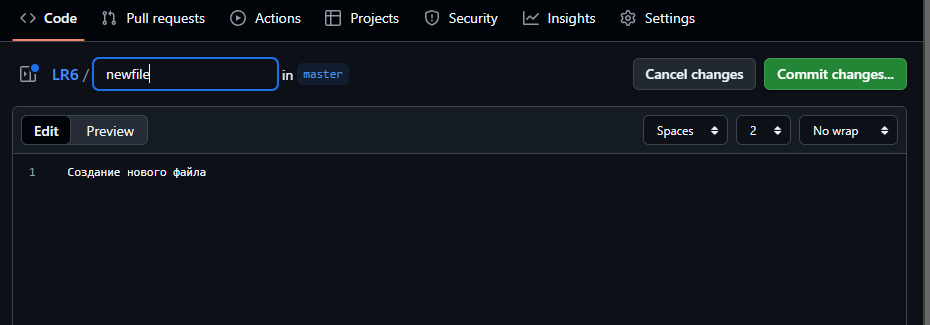
Рисунок 4. Процесс добавления файла в репозиторий

Для того чтобы подтянуть изменения после создания файла нужно воспользоваться командой git pull, которая подтягивает все изменения в репозитории с того момента, как они были подтянуты в последний раз (рис. №5).

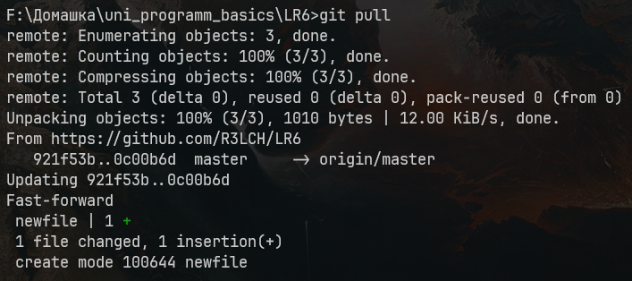
Рисунок 5. Подтягивание изменений с удаленного репозитория

Увидеть историю операций для любой ветки можно при помощи команды git log, она выводит все commit'ы в данной ветке (рис. №6, №7).

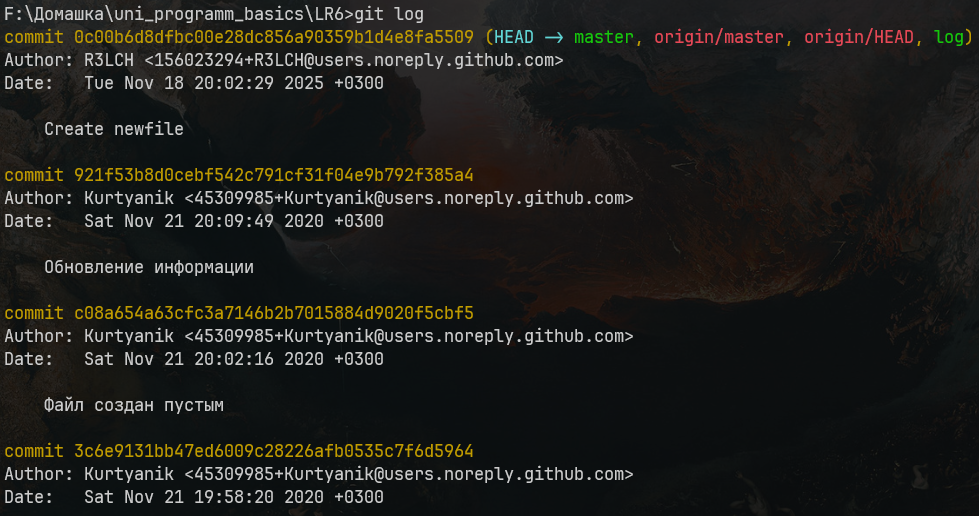
Рисунок 6. История ветки master

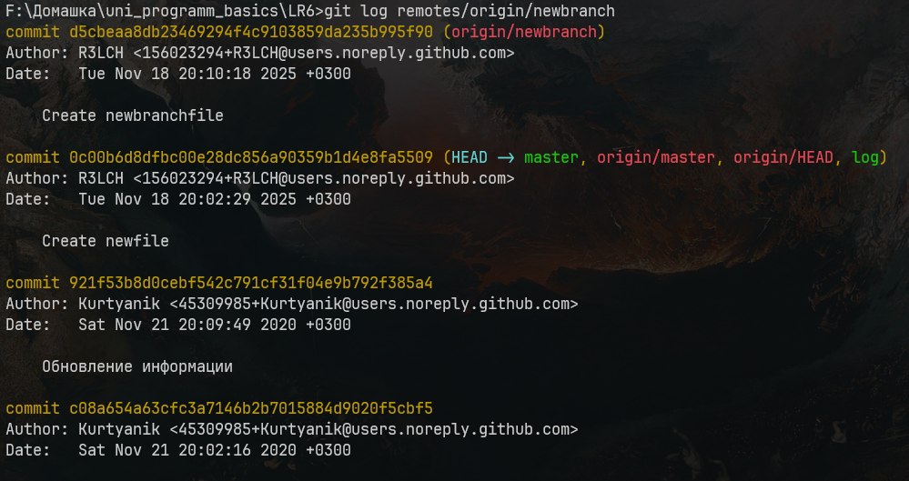
Рисунок 7. История ветки newbranch

Чтобы посмотреть последние изменения в проекте можно использовать команду git show, передав ей хэш последнего commit'а (рис. №8).

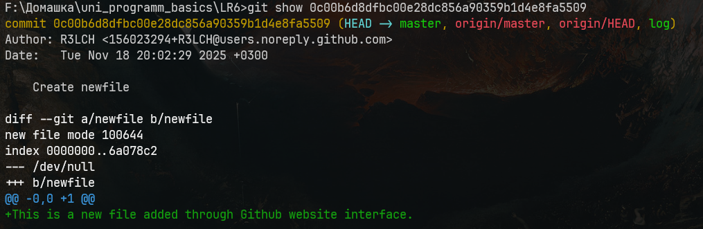
Рисунок 8. Последние изменения в проекте

Теперь для слияния обоих веток использована команда git merge (рис. №9). 

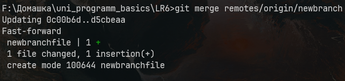
Рисунок 9. Слияние веток

Теперь ненужная ветка может быть удалена при помощи команды git push origin --delete (рис. №10).

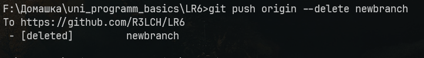
Рисунок 10. Удаление ветки

При любых изменениях нужно их зафиксировать (git add) и добавить в commit (git commit). После этого можно добавить их в удаленный репозиторий (git push). Этот процесс показан на рисунке №11.

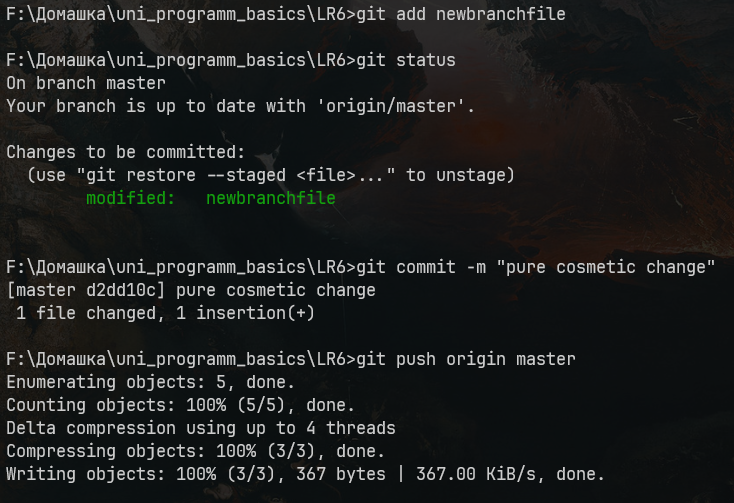
Рисунок 11. Добавление изменений

Если в commit попали изменения, которые не должны там быть, можно сделать откат commit'а при помощи команды git revert (рис. №12)

Рисунок 12. Откат изменений

Для просмотра полного лога команд использована команда git reflog. Ее результат приведен на рисунке 13.

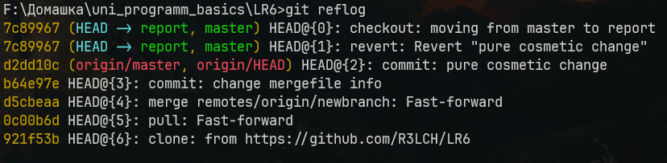
Рисунок 13. Полный лог команд

Полная история изменений в форматированном виде:

Рисунок 14. Полная история изменений